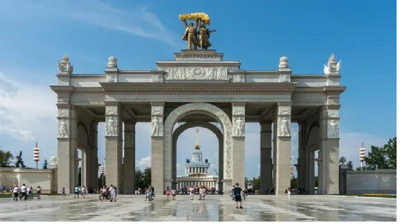

# ВДНХ
Вы́ставка достиже́ний наро́дного хозя́йства (ВДНХ) (в 1939—1959 годах — Всесою́зная сельскохозя́йственная вы́ставка (ВСХВ), в 1959—1992 годах — Вы́ставка достиже́ний наро́дного хозя́йства СССР (ВДНХ СССР), в 1992—2014 годах — Всеросси́йский вы́ставочный центр (ВВЦ)) — выставочный комплекс в Останкинском районе Северо-Восточного административного округа города Москвы, крупнейший выставочный комплекс в городе. Входит в 50 крупнейших выставочных центров мира. Ежегодно ВДНХ посещают 30 млн гостей. 1 августа 2019 года выставка отпраздновала 80-летний юбилей.
просп. Мира, 119В, Москва (Выставка достижений народного хозяйства)
Метро: Выставочный центр, ВДНХ, Улица Сергея Эйзенштейна

