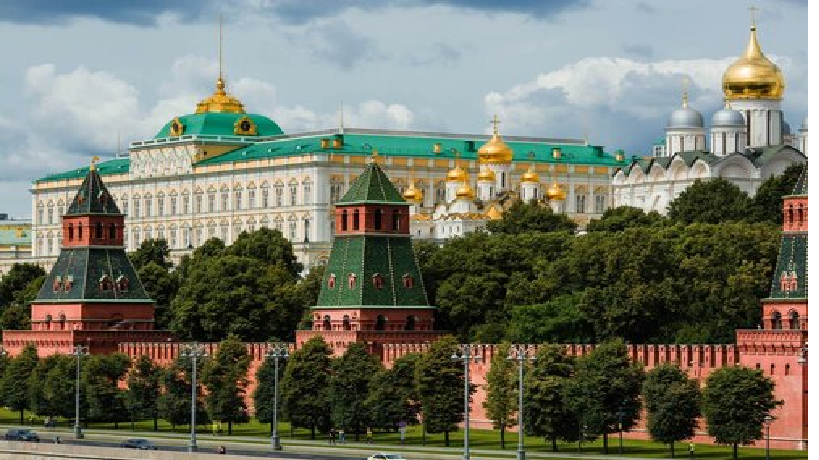

# Моско́вский Кремль
Моско́вский Кремль — крепость в центре Москвы и древнейшая её часть, главный общественно-политический и историко-художественный комплекс города, официальная резиденция Президента Российской Федерации, вплоть до распада СССР в декабре 1991 года была официальной резиденцией Генерального секретаря ЦК КПСС (в 1990—1991 годах — Президента СССР). Одно из самых известных архитектурных сооружений в мире.

Ивановская площадь, Москва
Метро: Александровский сад, Библиотека им. Ленина, Арбатская

