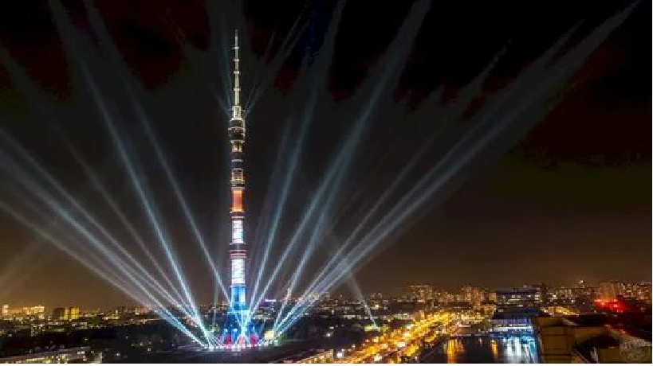

# Оста́нкинская телеба́шня
Оста́нкинская телеба́шня (прежнее название — «Общесою́зная радиотелевизио́нная передаю́щая ста́нция им. 50-ле́тия Октября́») — телевизионная и радиовещательная башня, расположенная в Останкинском районе Москвы. Высота здания — 540,1 м. По состоянию на весну 2022 года телебашня — 15-е по высоте сооружение из когда-либо существовавших, а также высочайшее сооружение в Европе и в России. Является членом-учредителем Международной федерации великих башен.

ул. Академика Королёва, 15, корп. 1, Москва
Метро: Телецентр, Улица Академика Королёва, Бутырская

