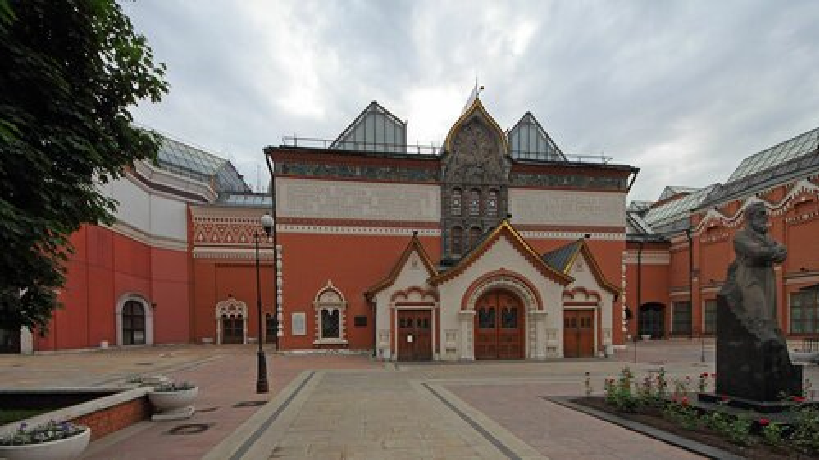

# Третьяко́вка
Третьяко́вская галере́я, Госуда́рственная Третьяко́вская галере́я (сокр. ГТГ; разг. Третьяко́вка) — российский государственный художественный музей в Москве, созданный на основе исторических коллекций купцов братьев Павла и Сергея Михайловичей Третьяковых; одно из крупнейших в мире собраний русского изобразительного искусства.

Лаврушинский пер., 10, стр. 4, Москва
Метро: Третьяковская, Новокузнецкая

